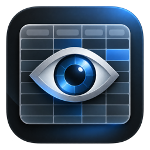

<p align="center">
  
</p>

<h1 align="center">Scan</h1>

<p align="center">A fast, native, read-only macOS viewer for Parquet, CSV, TSV, JSONL, SQLite and DuckDB files.</p>

Scan opens Parquet, CSV, TSV, JSONL (`.jsonl`), gzip-compressed CSV/TSV/JSONL (`.csv.gz`, `.tsv.gz`, `.jsonl.gz`), DuckDB and SQLite files. JSONL files contain one JSON object per line; fields become columns with automatically inferred types. It uses DuckDB for queries and a custom AppKit grid for large files, so a 4 GB Parquet file paints its first rows in well under half a second. Files are never modified.

- **Filter, sort and group** with DuckDB `WHERE` expressions, multi-column sorts and group-bys.
- **Quick Look**: press space on a file in Finder to see its first 10 rows.
- **Ask**: type a question and Scan turns it plus the file's schema into a read-only DuckDB query. It uses Apple's on-device Foundation Models framework, so it needs macOS 26 or later with Apple Intelligence available.
- **Export** the current filtered and sorted view as a new CSV or Parquet file.
- **CLI**: `scan file.parquet` opens a file from the terminal.

## Download and install

Download [Scan v1.0 for Apple Silicon Macs](https://github.com/anudit/scan/releases/tag/v1.0). Requires macOS 14 or later. Intel Macs are not supported by this release.

Open the `.dmg` and drag **Scan.app** to **Applications**, or extract the `.zip` and move **Scan.app** there. The ZIP also includes the optional `bin/scan` command, which you can copy to a directory on your `PATH` after installing the app.

This release is ad hoc signed and is not notarized. If macOS blocks the first launch, open **System Settings → Privacy & Security → Open Anyway** after trying to open Scan, then confirm. See [Apple's instructions](https://support.apple.com/en-us/102445).

Use **File → Open…**, drop a supported file onto Scan, or choose **Open With → Scan** in Finder. Set it as the default viewer with **Get Info → Open with → Scan → Change All…**. The Ask feature additionally requires macOS 26 or later with Apple Intelligence available.

## Build

Requires an Apple Silicon Mac running macOS 14 or later, Xcode with the macOS SDK, Python 3, CMake and Ninja. Install the additional build tools with `brew install cmake ninja` if needed.

```sh
scripts/build.sh
open dist/Scan.app
dist/bin/scan /path/to/file.parquet
```

On first use the build downloads DuckDB 1.5.6 archives and matching source, and checks their SHA-256 hashes. It builds a tailored library containing JSON, Parquet, core SQL functions and ICU, with autocomplete omitted. The app bundle includes the Quick Look preview extension, and `scripts/build.sh` registers it with Launch Services.

Create downloadable release archives after building with `scripts/package-release.sh`. The v1.0 app occupies approximately 48 MiB on disk; the archives are compressed.

Run the engine and query tests with:

```sh
swift test --disable-sandbox --build-system native
```

## Benchmarks: Scan versus Tad 0.14

These are medians of three runs on the same M2 Max, 64 GB Mac running macOS 27.0. Memory is the total process-tree physical footprint reported by `top`. The [raw Scan runs](bench/results/scan-v0.1/) and [Tad runs](bench/results/) are saved as JSON.

| Test | Tad | Scan | Scan plan budget |
|---|---:|---:|---:|
| App bundle on disk | 677 MB | 49 MB | ≤60 MB |
| 4 GB Parquet: first painted rows | ~2–3 s, estimated | 0.367 s | ≤0.4 s |
| 4 GB Parquet: CPU quiescence | 5.4 s | 2.2 s | ≤1 s |
| 4 GB Parquet: peak / idle memory | 699 / 562 MB | 99 / 95 MB | ≤250 / ≤120 MB |
| 4 GB Parquet: idle CPU | 0.9% | 0.27% | 0% |
| Small CSV: CPU quiescence | 4.3 s | 2.2 s | — |
| Small CSV: peak / idle memory | 372 / 311 MB | 87 / 84 MB | — / ≤60 MB |
| Scroll stress: mean / peak CPU | 67 / 107% | 12.8 / 53.9% | ≤15% mean |
| Scroll stress: CPU time | 7.4 CPU-s | 1.66 CPU-s | ≤1.5 CPU-s |
| Scroll stress: peak / later idle memory | 875 / 589 MB | 151 / 139 MB | ≤30 MB retained growth |
| Process count | 4 | 1 | 1 |

The 4 GB first-paint runs were 0.413, 0.367 and 0.327 s; the first missed the budget. Scan retained a median 43 MB of extra memory after scrolling, with large variation among the three runs. Quiescence and CPU figures use one-second samples, which miss much of Scan's sub-second loading activity; the reported 0 CPU-s load value is **not** a reliable speed or energy result. Tad first-paint time is an estimate from the plan, not a timed measurement. Both 4 GB open-and-idle runs used 30-second idle windows.

An Instruments Animation Hitches capture during 600 posted scroll events measured 458 Scan app updates over the selected ten-second interval: p99 update time **8.27 ms**, with two updates over 8.3 ms. It also recorded a **175 ms hitch** near the start of the stress action. App-update duration is not the same as displayed frame lifetime, so this does not establish zero dropped frames. The [trace summary](bench/results/scan-v0.1/scroll-animation-summary.json) is retained; the 6 GB raw trace was removed after export.

The separate [engine-only benchmark](bench/results/scan-v0.1/engine.json) measured a 33 ms first page, 837 ms sort-then-first-page, 266 ms filter count, and 377 ms license aggregation on the 4 GB file. The sort and aggregation miss their 300 ms and 250 ms targets. The [Tad-side query timings](bench/results/engine_floor.json) are an engine floor, **not Tad UI timings**, and use different query shapes for some operations.

Quick Look previews work, but their Finder latency has not been measured. The Ask feature requires Foundation Models availability on the device; it was built and unit-tested but has not yet been exercised end-to-end through the UI.

## License

Scan is released under the [MIT License](LICENSE). It bundles [DuckDB](https://duckdb.org), which is also [MIT-licensed](https://github.com/duckdb/duckdb/blob/v1.5.6/LICENSE). The app includes a copy at `Contents/Resources/DuckDB-LICENSE`.
